<h1 align="center">TravelLife</h1>


Project Travel Life is an event management website created using HTML, CSS, JS and Django. The main goal of this project was to learn about Django and Web Development. This Project was done as part of Web Development coursework to complete University Requirements.

### Installation

1. Clone this repository to your local machine.

2. Create a virtual environment using 

   ```Python
   python3 -m venv myvenv
   
   # Or
   
   python -m venv myvenv
   ```

   `myvenv` will be the name of your virtual environment.

3. Activate the virtual environment

   ```
   myvenv\Scripts\activate
   ```

4. Install the requirements given in `requirements.txt`

   ```wiki
   pip install -r requirements.txt
   ```

5. Locate the `manage.py` file and navigate to its directory. Run the command to start the server

   ```
   python manage.py runserver
   ```

6. Copy the URL and open in your browser.

7. Voila! You now have the Django app running in your browser.

### **Screenshots**

**Home Page**

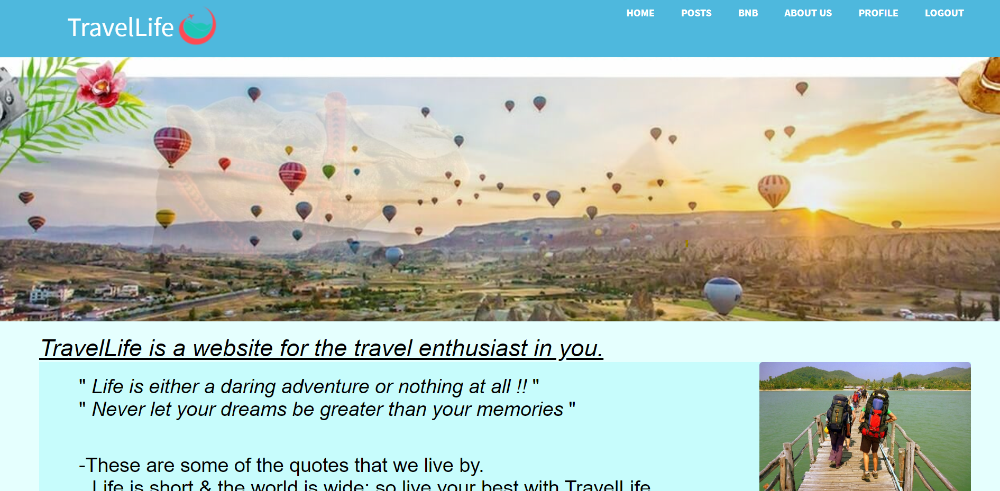

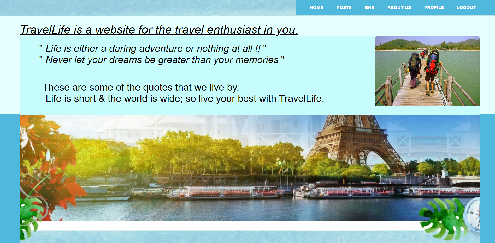

**Posts**

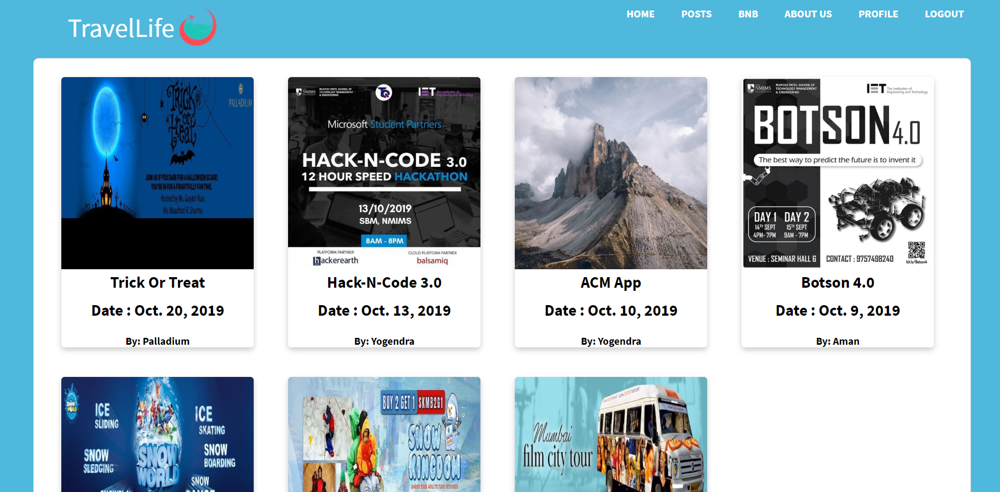

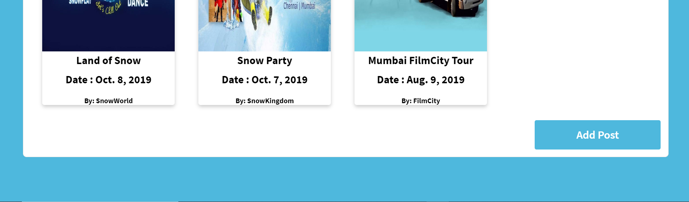

**Rooms**

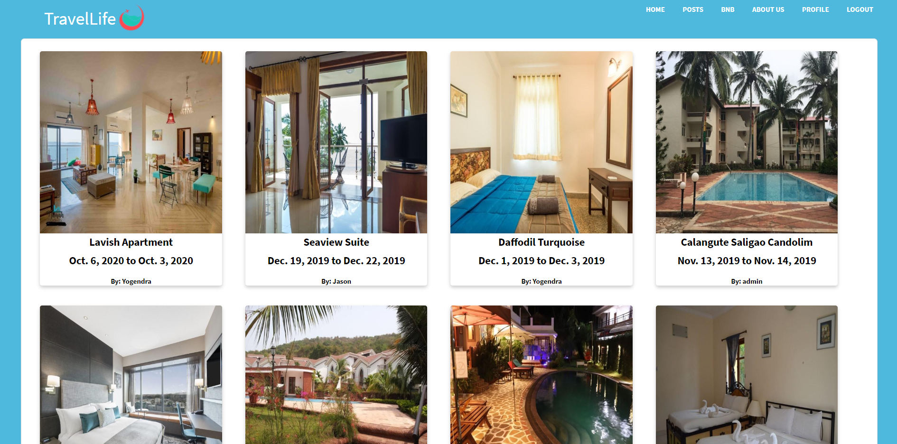

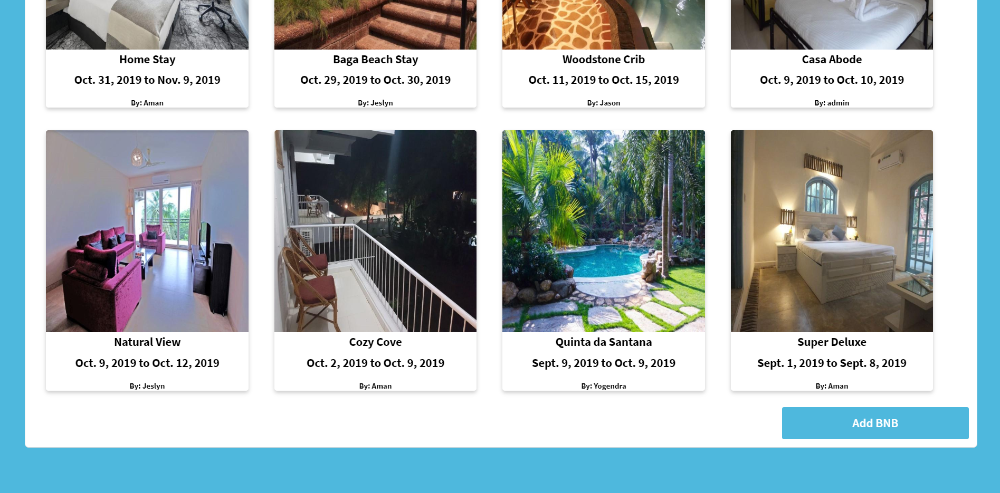

**Sign Up**

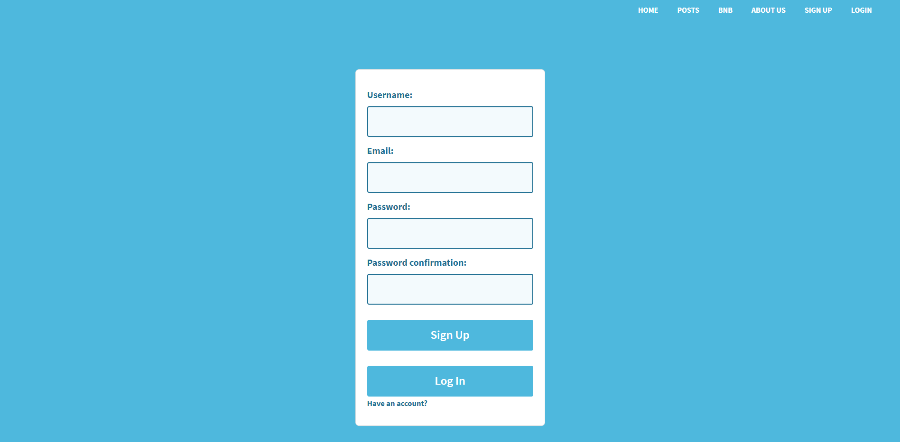

**Login**

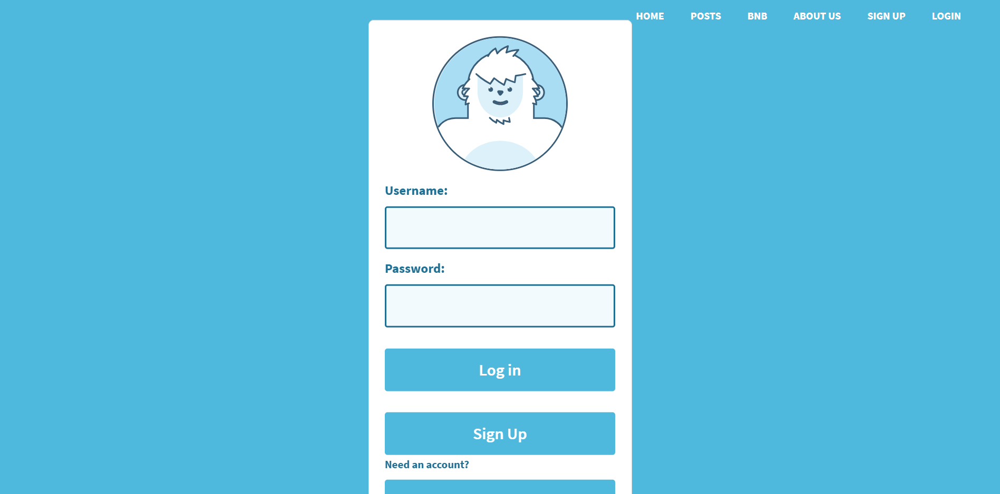

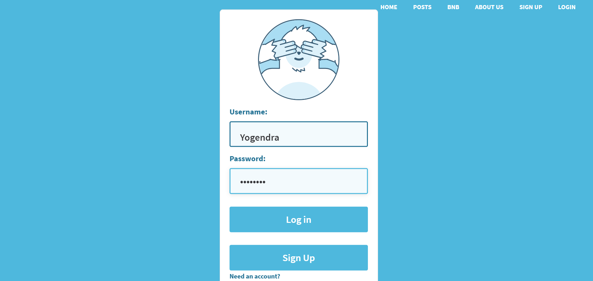

**Your Profile**

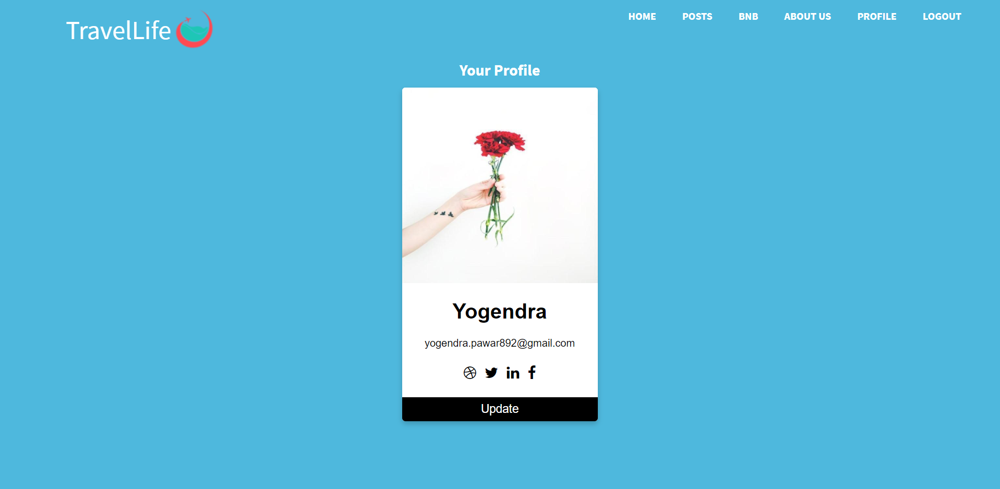

**Your Post**

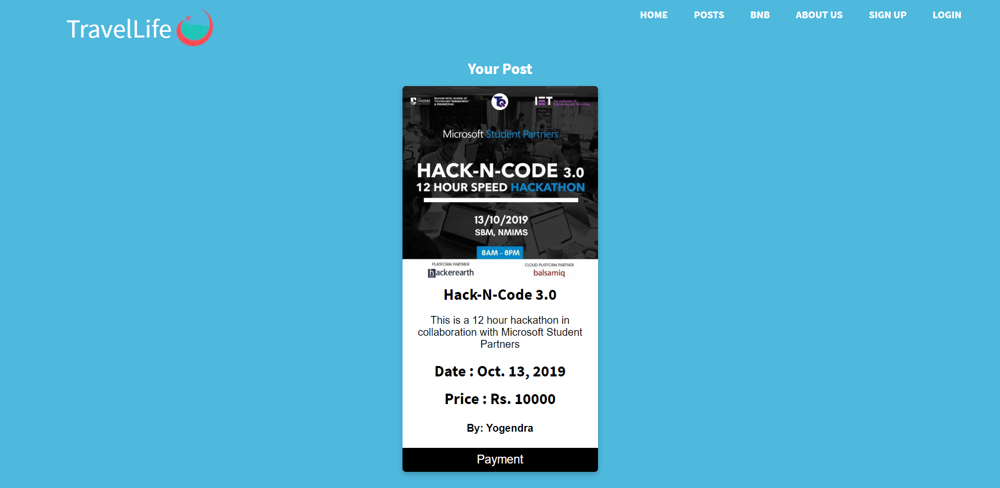

**About Us**

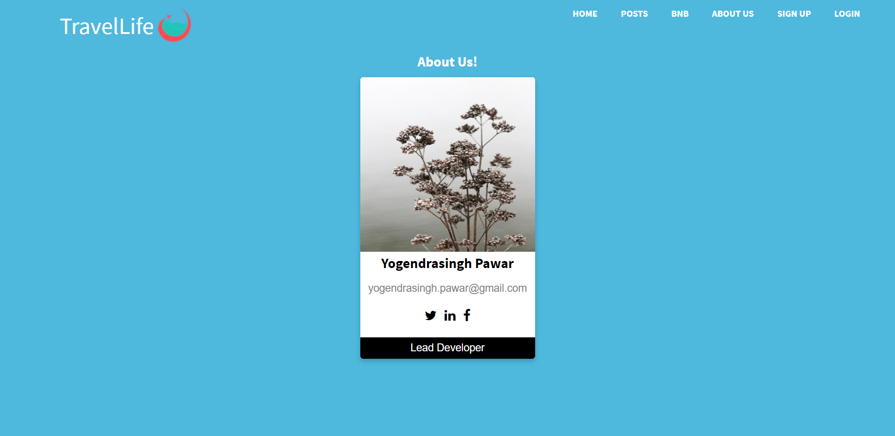

### Acknowledgements

The `Django Documentation` is really good and helped a lot in this project. Apart from this `Corey Schaefer's videos`, `Django Girls` Project also served as a good reference.
